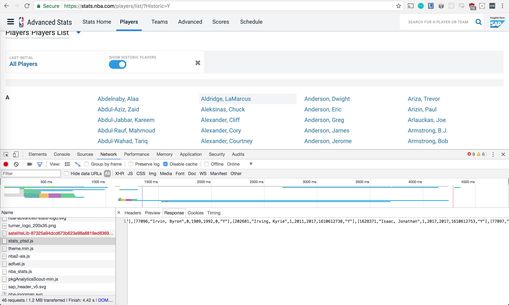

I had a debate with some friends if the NBA's best three point shooters get "better" at shooting the three with age. I have a couple ideas behind this that I hope to back up with data soon.

1. If these are the leagues most prolific three point shooters, then they will be / have been / were in the league for a long time.
2. When these players were young, they had to prove themselves on the court and couldn't spend the whole game shooting threes. They were more agile and had to get in the paint or drive the lane and play hard defense.
3. As they got / get older, they lost their edge in driving, bodying people in the paint, and playing hard nosed defense, so they had to focus on an aspect of their game where they could add value to the team, i.e., the three ball.
4. As older, eststablished greats in the league, offensive possessions are drawn around their ability to shoot threes.
5. The three is something that surely gets better with practice.

Assuming my assumptions are correct, (and each of these can surely be debated), I think the logic follows that a great three point shooter will get better at making threes as they get older.

So my hypothesis is

$$H_0$$: "great" three point shooters "get better" with age

The first thing is to define "great" three point shooters. I've decided to measure greatness by career three pointers made. This is what pops up when googling "great three point shooters", and it gives a list of players that are historically recognized as great three point shooters.

Now, defining "get better" is a little more challeging. Is a player getting better at threes if he has a higher three point percentage for a season or more threes made? I'm going with percentage, because we'll get to see if the players who make the most threes get more accurate with age.

So our new hypothesis is

$$H0:$$ the nba players who have made the most threes in their career get more accurate with age

This is where my debate with friends led too, and it's were I'll start my investigation.

## Grabbing names from Wikipedia

```
def get_names():
    from bs4 import BeautifulSoup, SoupStrainer
    import requests

    result = requests.get(
      'https://en.wikipedia.org/wiki/List_of_National_Basketball_Association_career_3-point_scoring_leaders'
    )
    soup = BeautifulSoup(result.content, 'html.parser')

    links = soup.find_all(class_="sortkey")
    names = []
    for link in links:
        names.append(link.getText())

    return names
```

```
> ['Allen, Ray', 'Miller, Reggie', 'Terry, Jason', 'Pierce, Paul', ...]
```

## Converting to playerids

The names are no help for interacting the the stats.nba.com api, so we need to convert to their playerids. This was a little tricky. After searching through the API and website, I found my best bet was to dig into the nba website. I found a list of players at `"https://stats.nba.com/players/list/?Historic=Y"`and first attemptted was to use Beautiful Soup again to parse the file, but the list is generated from angular and Beautiful Soup does not run javascript when parsing, so all I got was `<a>::playerid</a>`.

Luckily, I found the mapping from player to ID in the source files


I deleted the unneccessary information from the file and was left with just the players and ID rows, and saved it as a JSON file to interact with it easily.

## Mapping names to ids

Ideally, the file would be a dictionary from player name to id, but it's just a list of lists with player names and ids. But the file is small enough that we can just loop through it looking for our top players.

```
def get_pids(names):
    import json
    jso = json.load(open("./players_and_ids.json"))
    names_and_ids = []
    for name in names:
        for e in jso['players']:
            if e[1] == name:
                names_and_ids.append({"name": name, "pid": e[0]})
    return names_and_ids
```

```
> [{'name': 'Allen, Ray', 'pid': 951}, {'name': 'Miller, Reggie', 'pid': 397},
{'name': 'Terry, Jason', 'pid': 1891}, {'name': 'Pierce, Paul', 'pid': 1718}, ...]
```

## Grabbing player stats

Finally, we can grab the player stats. This step leverages with stats.nba.com API.

```
def get_player_3s(pid):
    import requests, json
    import matplotlib.pyplot as plt

    headers = {
        "user-agent": "Mozilla/5.0 (Macintosh; Intel Mac OS X 10_11_2) AppleWebKit/601.3.9 (KHTML, like Gecko) Version/9.0.2 Safari/601.3.9"
    }

    response = requests.get("http://stats.nba.com/stats/playercareerstats/?PlayerID=%s&PerMode=Totals" % pid, headers=headers)
    data = json.loads(response.text)
    years = []
    fg3ms = []
    fg3as = []
    for r in data['resultSets'][0]["rowSet"]:
        FG3M = r[12]
        FG3A = r[13]
        FG3_PCT = r[14]
        MIN = r[8]
        years.append(r[1])
        fg3ms.append(FG3M)
        fg3as.append(FG3A)

    return (years, fg3ms, fg3as)
```
