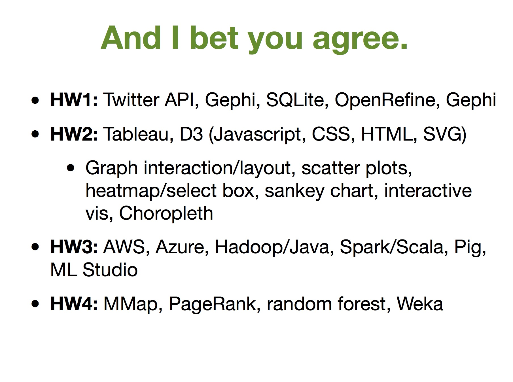

<!-- # Machine Learning Your Death -->

Here's a project a few friends and I created for Dr. Polo Chau's class, CX4242 - Data and Visual Analytics. This was one of my favorite classes at Tech, and judging from the size of the class, breath of the class, and rave reviews from friends in all different majors, it's a lot of people's favorite class.

Like I said, the class had a LOT of breath. Here's a slide from the last day of class acknowleding how many different and diverse technologies we used. Back in June, I couldn't image being comfortable with these twenty-some technologies

Anyways, the project for this class had three criteria:

1. at least one large, real dataset;
2. some non-trivial analysis/algorithms/computation performed on the dataset (e.g., computing basic statistics, like average, min/max will not be enough); and
3. an interactive user interface that interact with the algorithms (can be visual, voice-controlled, on tablet, desktop, etc.).

So for our project, we attempted to predict how you're going to die. We got a

1. large dataset from the cdc

We cleaned, parsed, and joined the data into a usable form, and stored it back as a csv. Then we used python and pandas to further manipulate the data. This second manipulation step was required because we didn't quite know what we wanted to do with the data. For example, we decided to one-hot encode it to remove numerical relations on the categorical data.

Now with regards to the data, we had five fields to predict a persons death out of fourty-three different causes... so early on we gave up the dream of very accurate predictions, and in turned created a fun and interesting user interface.

Click [here](http://cx.sam-ford.me) to check out the site and see how you die as time passes based on your age, race, gender, marital status, and education.
