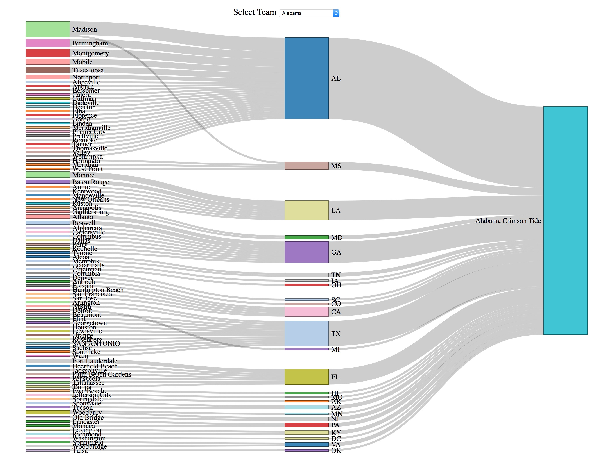

After watching an [incredible](!bakerscoringatouchdown.com), [thrilling](!georgiawinning.com), [record setting](!google.com) Rose Bowl game between the georgia Bulldogs and the Oklahoma Sooners, I began to wonder from where each team recruits and which teams recruit from the most diverse player base, .i.e., the most number of states and most spread. My hypothesis is different for Power 5 teams and G5 teams.

[Click here to investigate for yourself!](http://cfbrecruiting.sam-ford.me)

### Power 5

If the team is in a Power 5 conference (Big 10, SEC, ACC, Big 12, Pac-12) or claim religious exemption from conference play (Notre Dame), then they have the most resources to recruit the best, so they get the best recruits. Since they have the best players they are perenially the best teams in the country and this feeds back into recruiting better players. Conversely, public schools have incentives to give recruit in state, so they will likely have an exceptional number of in state kids.

So what is going to convince the best players to go across the country to play football? Here are some of the factors I think are important for fielding a team from all across the country.

* Current CFB ranking
* Private
* Academics
* Fun
* Professional prospects
* Historical success

Let's look at some teams that check some of these boxes.

#### Alabama

Unsurprisingly, Alabama, a state school, gets a fair amount of kids from Alabama. However, they currently great, historically great, and dedicate a lot of money to the football program, so they can get kids from all around the country.

#### Oklahoma

Oklahoma, another historically and currently great football school, recruits heavily from Oklahoma and Texas. Texas is a total football state, and has enough people to pass some just over one state line.

#### USC

USC is a private school, has great academics, a history of sending players to the nfl, and from what I've heard is a very fun school, and yet it recruits almost exclusively from California.

#### Stanford

As predicted, Stanford has one of the most diverse teams, with a slight preference for Californian recruits.

#### Notre Dame

Notre Dame is very similar to Stanford in terms of team diversity for all the same reasons, just a little more weighted to the midwest, naturally.
