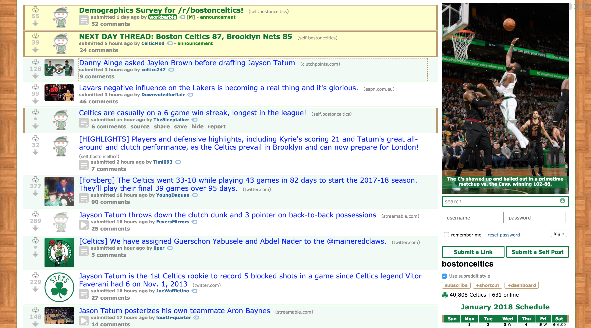
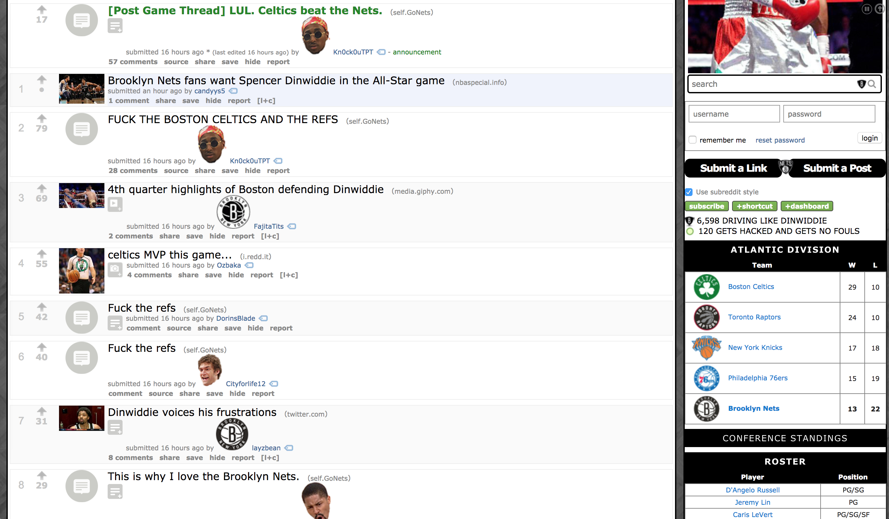

Reddit is a content aggregation site where users submit pictures, and links, and videos, and just about anything else. Inside reddit, there are places called subreddits, which set the topic of discussion and content. Each NBA team has their own subreddit, and fans, or anyone, but mostly fans, can post content relating to their team. Here's a look at the top posts of the day for the Boston Celtics subreddit, [reddit.com/r/bostonceltics](reddit.com/r/bostonceltics).



The Celtics played the Nets last night. Here's a picture of their subreddit, [reddit.com/r/gonets](reddit.com/r/gonets) after the game. I don't think I need to say who won the game.



These two pictures exemplify my idea that you can tell who won a game by the feelings of fans on their teams subreddit.

### Getting the Winners and Loser From the Day

Before doing anything else, we need to get the winners and losers. Since we're building our "training set", we want to keep each team labeled as a winner or a loser so we can find a pattern once we collect enough data. I looked into an API or two to get the games data, but I settled on scraping the data myself from basketball-reference.com because the APIs couldn't do exactly what I wanted. I hope to replace this code with an API since basketball-reference.com can change their website anytime.

```python
def get_days_teams():
    # get games of the day
    from bs4 import BeautifulSoup, SoupStrainer, Comment
    import requests

    headers = {
        "user-agent": "Mozilla/5.0 (Macintosh; Intel Mac OS X 10_11_2) AppleWebKit/601.3.9 (KHTML, like Gecko) Version/9.0.2 Safari/601.3.9",
    }

    now = datetime.datetime.now()

    url = "https://www.basketball-reference.com/boxscores/?month={0}&day={1}&year={2}".format(now.month, now.day-1, now.year)

    result = requests.get(url, headers=headers)
    soup = BeautifulSoup(result.content, 'html.parser')
    content = soup.findAll(class_="teams")

    winners = []
    losers = []
    for teams in content:
        # find winner
        winner = teams.find(class_="winner")
        for td in winner.find('td'):
            winners.append(td.text)
        loser = teams.find(class_="loser")
        for td in loser.find('td'):
            losers.append(td.text)

    return winners, losers
```

```python
> ['Boston', 'Detroit', 'Indiana', 'Golden State', 'Minnesota', 'Cleveland', 'Sacramento', 'Milwaukee']
> ['Brooklyn', 'Houston', 'Chicago', 'LA Clippers', 'New Orleans', 'Orlando', 'Denver', 'Washington']
```

### Retrieving Subreddit Posts

Once we have the winners and losers, we can map those to their respective subreddit and grab the top posts from the day.

```python
def get_posts(subreddit):
    from bs4 import BeautifulSoup, SoupStrainer, Comment
    import requests

    headers = {
        "user-agent": "Mozilla/5.0 (Macintosh; Intel Mac OS X 10_11_2) AppleWebKit/601.3.9 (KHTML, like Gecko) Version/9.0.2 Safari/601.3.9",
    }

    result = requests.get('https://www.reddit.com' + subreddit, headers=headers)
    soup = BeautifulSoup(result.content, 'html.parser')
    content = soup.findAll(class_="title")

    titles = content[2:-4:2] # need to cut out first two and last two, and remove repeating titles

    sentences = [sen.text for sen in titles]
    paragraph = ' '.join(w.strip() for w in [sen.text for sen in titles])
    return paragraph, sentences
```

This code returns both each individual post, under sentences, and a full paragraph of each sentence joined together. It's still too early to decide what provides a better metric, so I'm using both.

### Analyzing Sentiment

Now we can analyze the posts individually and the posts as a whole.

```python
import nltk
from nltk.sentiment.vader import SentimentIntensityAnalyzer
# nltk.download('vader_lexicon')
# nltk.download('punkt')

def analyze_paragraph(paragraph):
    sid = SentimentIntensityAnalyzer()
    ss = sid.polarity_scores(paragraph)
    return ss['pos'], ss['neu'], ss['neg'], ss['compound']

def analyze_sentences(sentences):
    sid = SentimentIntensityAnalyzer()
    pos, neu, neg, com = 0
    for sentence in sentences:
        ss = sid.polarity_scores(sentence)
        pos += ss['pos']
        neu += ss['neu']
        neg += ss['neg']
        com += ss['compound']
    return pos, neu, neg, com
```

NLTK, or Natural Language Toolkit, has a package that can analyze the sentiment of text. Running polarity_scores on some text gives four scores.

```python
> pos: 0.876, neu: 0.124, neg: 0.0, compound: 0.7925
```

Positive, neutral, and negative are all sentiment measures. Compound is what tells the intensity of positivity and negativity and is bounded between -1 and 1. When compound is close to 1, the text is super positive, and when it's close to -1, it's super negative. Here's a great, very in depth stack overflow post explaining exactly how the compound measure works. I intend to use the compound score, but I'm going to keep all the other scores as well. Space isn't an issue, so no sense in throwing it away before I make my prediction model.

analyze paragraph takes in the full text joined together for each subreddit and returns the single compound score. analyze sentences takes in the list of posts and calculates the sum of compound scores. Each team has the same number of posts, so we don't need to worry about normalizing right now. Perhaps we'll need to once we start creating a model with more data, but it's good right now.

### Getting Results

Finally, we can put all these pieces together and find the scores for each team.

```python
def compute_all():
    winners, losers = get_days_teams()
    winner_data = compute_winners(winners)
    loser_data = compute_losers(losers)
    data = winner_data + loser_data
    return data

def compute_winners(winners):
    data = []
    for team in winners:
        paragraph, sentences = get_posts(subreddits[team])
        sen_pos, sen_neu, sen_neg, sen_com = analyze_sentences(sentences)
        par_pos, par_neu, par_neg, par_com = analyze_paragraph(paragraph)
        data.append([team, sen_pos, sen_neu, sen_neg, sen_com, par_pos, par_neu, par_neg, par_com, True])
    return data

def compute_losers(losers):
    data = []
    for team in losers:
        paragraph, sentences = get_posts(subreddits[team])
        sen_pos, sen_neu, sen_neg, sen_com = analyze_sentences(sentences)
        par_pos, par_neu, par_neg, par_com = analyze_paragraph(paragraph)
        data.append([team, sen_pos, sen_neu, sen_neg, sen_com, par_pos, par_neu, par_neg, par_com, False])
    return data
```

Note the format of the output for each team. I'm storing each game for each team as a row with the team name, the post score, the total score, and a boolean variable indicating if they won or lost. This allows me to export the data very simply to a csv and interact with it with Pandas in the future or analysis. I've found it's extremely important to really think about how you want to store your data and what data you want to store. If space is not an issue, it's better to just have more data because you can't go back and get the data ¯\\\_(ツ)\_/¯

### Storing for Later Use

Now we can store the data in pandas, view the results, and append to an existing csv file.

```python
# store results
import pandas as pd
import datetime
import os

data = compute_all()
df = pd.DataFrame(data, columns=['team', 'sen_pos', 'sen_neu', 'sen_neg', 'sen_com', 'par_pos', 'par_neu', 'par_neg', 'par_com', 'won'])
df['date'] = pd.to_datetime(datetime.datetime.now())
df.index = df['date']
del df['date']
with open('nba_sentiment.csv', 'a') as f:
    df.to_csv(f, index=False, mode='a', header=(not os.path.exists(f)))
```

Which gives the results

<div class="table-wrapper">

| date       | team         | sen_pos | sen_neu | sen_neg | sen_com | par_pos | par_neu | par_neg | par_com | won   |
| ---------- | ------------ | ------- | ------- | ------- | ------- | ------- | ------- | ------- | ------- | ----- |
| 2018-01-07 | Boston       | 1.508   | 24.014  | 1.478   | 1.0604  | 0.080   | 0.874   | 0.046   | 0.9163  | True  |
| 2018-01-07 | Detroit      | 0.638   | 25.185  | 0.177   | 1.2514  | 0.054   | 0.931   | 0.015   | 0.8574  | True  |
| 2018-01-07 | Indiana      | 3.831   | 21.794  | 1.375   | 4.4474  | 0.113   | 0.844   | 0.043   | 0.9365  | True  |
| 2018-01-07 | Golden State | 2.746   | 23.576  | 0.677   | 4.3177  | 0.131   | 0.836   | 0.033   | 0.9906  | True  |
| 2018-01-07 | Minnesota    | 2.113   | 22.509  | 1.378   | 1.6908  | 0.091   | 0.862   | 0.047   | 0.9365  | True  |
| 2018-01-07 | Cleveland    | 2.913   | 23.112  | 0.975   | 3.8053  | 0.141   | 0.821   | 0.037   | 0.9888  | True  |
| 2018-01-07 | Sacramento   | 2.314   | 21.636  | 1.050   | 1.9895  | 0.096   | 0.865   | 0.039   | 0.9307  | True  |
| 2018-01-07 | Milwaukee    | 2.728   | 21.862  | 2.410   | 0.5261  | 0.112   | 0.786   | 0.102   | 0.7825  | True  |
| 2018-01-07 | Brooklyn     | 2.462   | 20.851  | 2.687   | 0.1842  | 0.094   | 0.822   | 0.084   | 0.6326  | False |
| 2018-01-07 | Houston      | 1.780   | 22.713  | 1.507   | 0.0988  | 0.091   | 0.847   | 0.062   | 0.9347  | False |
| 2018-01-07 | Chicago      | 2.207   | 22.777  | 1.016   | 4.1347  | 0.097   | 0.867   | 0.035   | 0.9806  | False |
| 2018-01-07 | LA Clippers  | 1.214   | 24.353  | 1.433   | 0.8443  | 0.050   | 0.914   | 0.036   | 0.5914  | False |
| 2018-01-07 | New Orleans  | 2.023   | 20.676  | 2.301   | -0.0109 | 0.083   | 0.853   | 0.064   | 0.5754  | False |
| 2018-01-07 | Orlando      | 1.822   | 23.606  | 0.572   | 1.7442  | 0.093   | 0.888   | 0.019   | 0.9718  | False |
| 2018-01-07 | Denver       | 1.724   | 23.939  | 1.337   | 1.1355  | 0.085   | 0.866   | 0.049   | 0.9214  | False |
| 2018-01-07 | Washington   | 2.808   | 21.159  | 2.033   | 1.9738  | 0.129   | 0.787   | 0.083   | 0.9325  | False |

</div>

### Future Plans for Pt. 2

With the pipeline all setup, I just have to run this code every night after the day's game to start building up this dataset. The next steps are to analyze what sentiment is correlated to a win. Thanks for reading and stay tuned for pt. 2!
