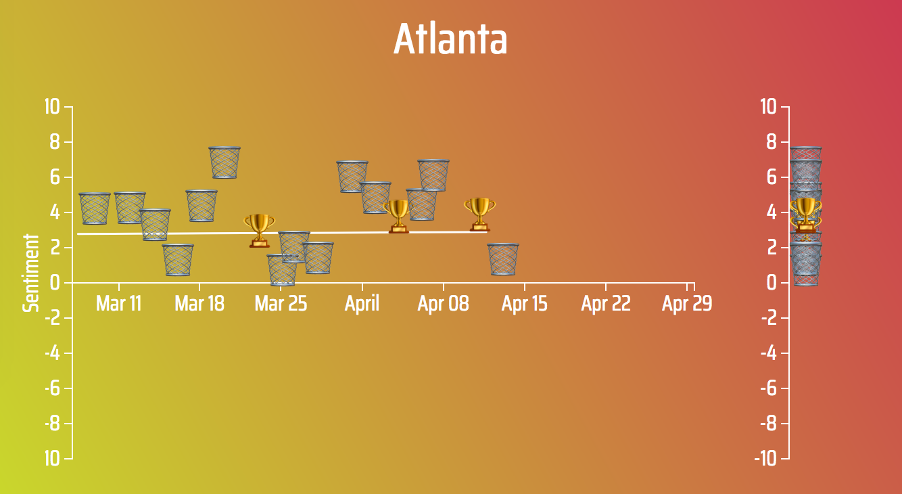

The NBA playoffs are in full swing, and it's a perfect time to showcase the teenage girl level mood swings of nba reddit. Before diving into any sort of predictive capabilities of individual subreddits, I pieced together a simple visualization. [CHECK IT OUT (in Firefox until I correctly set the webkit gradients)](http://nbasentiment.sam-ford.me).

So what we see here is a plot of each game for each team, with date on the x-axis, and the sentiment of the corresponding subreddit the next day.

Take a look at Utah and Minnesota, for example. They have very high highs when they win, and get really down when they lose. Both these teams fought for a playoff spot all the way to the last game of the regular season, so it makes sense their fans feel every single game is do or die, and respond accordingly.

Then there's a group of teams that clinched playoff births early and their sentiment is not too correlated with wins and losses, and instead comes from external influences. For example, the Boston Celtics spent a good chunk of the season 1st in the East and were comfortably in the playoffs with many games still left. So the discussion was taken over by injury reports about Hayward, Irving, Smart, Brown, Theis, etc., and praises for our young guns and deep bench players stepping up and playing well, even when we take a loss. This also applies to teams like Houston, the best team in the West, and Golden State, who were very comfortably in the playoffs, so had their subreddits dominated by other updates (including injury updates) and not tied to wins and losses as heavily.

Another group of teams see an inverse relationship between sentiment and winning. These are the teams that are tanking and are actively trying to lose games. As an aside, I don't think this is healthy for the league, but it's very clear that a team does not stand a chance of winning even a conference finals without an all-star on their team, and you're not going to get one of those players in the middle of the draft. It's unfortunate that Philly went from a 26 win season to maybe the best team in the East by intentionally tanking, because it makes tanking seem like the best choice. I don't know. It's easy to see this as a problem when I'm a fan of a big market team that will always be able to buy players and convince them to come to Boston.

In Pt 3, I'll post some analysis I've already done on the games and potentially set up a system for "predicting" the previous night's games based on the subreddit sentiment.
